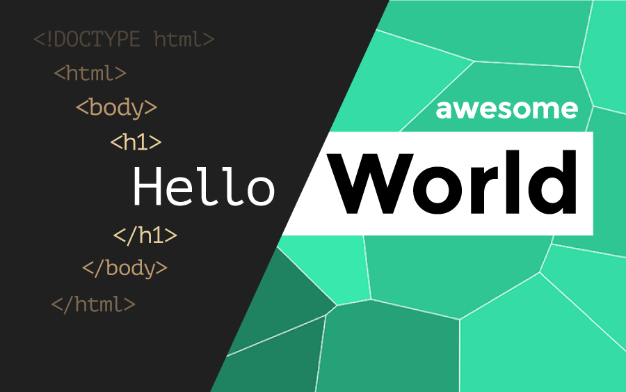

Awesome "Hello World"
====================
 
### Introduction to HTML&CSS Workshop for Graphic Designers
 

## About

During this workshop you will design and develop a small responsive website while exploring the creative possibilities and technical limitations of HTML&CSS and designing for screen. The aim of the workshop is to introduce you to the fun of coding, giving you a taste of professional development tools and methods at the same time. 
Coding is often perceived by designers as a complicated and very technical process. The aim of this workshop is to show you the creative side of coding first, and introduce you to core tools and methods of designing and developing a website in a fun and non-conventional way. Starting from the very basics, you'll then dive deep into a particular area of HTML&CSS, depending on the creative idea of your design.

## What will you need? 

* Pen and Sketchbook
* Laptop
* Chrome Browser
* Brackets Code Editor

## You will learn about 

* Thumbnail sketching 
* Using online coding tools
* Using a code editor
* Coding in HTML
* Coding in CSS
* Designing Typography for web
* Designing for screen
* Responsive Design
* Using browser developer tools

Examples

